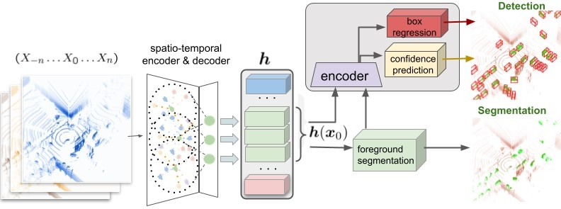

# ST_PointRCNN -- Modified for Kitti/Custom Dataset

### For more details of PointRCNN, please refer to [the original paper](https://arxiv.org/abs/1812.04244) or the author git [project page](#).


## Installation
### Requirements
All the codes are tested in the following environment:
* Linux (tested on Ubuntu 18/16)
* Python 3.6+
* PyTorch 1.0

### Install PointRCNN 

a. Clone the PointRCNN repository.
```shell
git clone --recursive https://github.com/awethaileslassie/ST_PointRCNN.git
```
If you forget to add the `--recursive` parameter, just run the following command to clone the `Pointnet2.PyTorch` submodule.
```shell
git submodule update --init --recursive
```
b. The below conda command will create the conda environment and Install all the dependent python, Cuda libraries like easydict,tqdm, tensorboardX etc.
```
conda env create --file environment.yaml
conda activate pointrcnn1
```
c. Build and install the `pointnet2_lib`, `iou3d`, `roipool3d` libraries by executing the following command:
```shell
sh build_and_install.sh
```

### Dataset preparation
Arrange all training logs of Kitti dataset, inside in a single folder. Copy the address of that directory to in yaml file.
NB: Transform the lidar frames from past and future into the reference frame coordinate frames in the format of [x,y,z,t], where t denots the time, t=-t in case of past and +t in case of future frame. 


```
# For KITTI Dataset         
└── KITTI_DATASET_ROOT
       └── training
       			├──lidar
       			├──label
       			├──poses
       			└──label_legend         
       └── validation
       			├──lidar
       			├──label
       			├──poses
       			└──label_legend       			    
```
## modify the .yaml file accordiningly

```
CFG.DATA_PATH = '../../data/lidar' # Change this as per your path
```

```
CFG.VAL_DATA_PATH = '../../data/lidar' # Change this as per your path
```

```
CFG.past_frame = 5 # Change this to how many past frames you want to use
```

```
CFG.future_frame = 5 # NB: CFG.future_frame should be 0 for student model, since we are only going to use past frames in the Student model
```

## Teacher model

### Pretrained model
#### Quick demo
You could run the following command to evaluate the pretrained model:  First navigate in to Teacher/tools/script

then run

```
sbatch run_teacher_test_det_mf1500_w3_p16384_augm_f1_1.sh
```

or

```
python ../eval_rcnn.py --cfg_file ../cfgs/test/test_kitti_train_mf1500_w3_p16384_agum_f1_1.yaml --ckpt ../output/teacher/rcnn/kitti_train_mf1500_w3_p16384_agum_f1_1/ckpt/best.pth --batch_size 1 --eval_mode rcnn --output_dir ../test/DET/teacher/kitti_train_mf1500_w3_p16384_agum_f1_1
```

### Training

#### Training of RPN stage
* To train the first proposal generation stage of PointRCNN with a single GPU, run the following command: 
First navigate in to Teacher/tools/script

```
python ../train_rcnn.py --cfg_file ../cfgs/teacher/kitti_train_mf1500_w3_p16384_agum_f1_1.yaml --batch_size 16 --train_mode rpn --epochs 200 --output ../output/teacher/rpn/kitti_train_mf1500_w3_p16384_agum_f1_1
```

* To use **mutiple GPUs for training**, simply add the `--mgpus` argument as follows:
```
CUDA_VISIBLE_DEVICES=0 python ../train_rcnn.py --cfg_file ../cfgs/teacher/kitti_train_mf1500_w3_p16384_agum_f1_1.yaml --batch_size 16 --train_mode rpn --epochs 200 --output ../output/teacher/rpn/kitti_train_mf1500_w3_p16384_agum_f1_1 --mgpus
```

After training, the checkpoints and training logs will be saved to the corresponding directory according to the name of your configuration file. Such as for the `kitti_train_mf1500_w3_p16384_agum_f1_1.yaml`, you could find the checkpoints and logs in the following directory:

```
ST_PointRCNN_KITTI2/tools/output/teacher/rpn/kitti_train_mf1500_w3_p16384_agum_f1_1/
```
which will be used for the training of RCNN stage. 

#### Training of RCNN stage
Suppose you have a well-trained RPN model saved at `output/teacher/rpn/kitti_train_mf1500_w3_p16384_agum_f1_1/ckpt/checkpoint_epoch_200.pth`, 

```
python ../train_rcnn.py --cfg_file ../cfgs/teacher/kitti_train_mf1500_w3_p16384_agum_f1_1.yaml --batch_size 16 --train_mode rcnn --epochs 70 --ckpt_save_interval 1 --rpn_ckpt ../output/teacher/rpn/kitti_train_mf1500_w3_p16384_agum_f1_1/ckpt/best.pth --output ../output/teacher/rcnn/kitti_train_mf1500_w3_p16384_agum_f1_1

```
* Once the model is fully trained 
### Inference to generate Pseudo labels
* To evaluate a single checkpoint, run the following command with `--ckpt` to specify the checkpoint to be evaluated:
```
python ../eval_rcnn.py --cfg_file ../cfgs/test/test_kitti_train_mf1500_w3_p16384_agum_f1_1.yaml --ckpt ../output/teacher/rcnn/kitti_train_mf1500_w3_p16384_agum_f1_1/ckpt/best.pth --batch_size 1 --eval_mode rcnn --output_dir ../test/DET/teacher/kitti_train_mf1500_w3_p16384_agum_f1_1
```

* To generate the results on the *test* split, please modify the `TEST.SPLIT=TEST` and add the `--test` argument. 

Here you could specify a bigger `--batch_size` for faster inference based on your GPU memory. Note that the `--eval_mode` argument should be consistent with the `--train_mode` used in the training process. If you are using `--eval_mode=rcnn_offline`, then you should use `--rcnn_eval_roi_dir` and `--rcnn_eval_feature_dir` to specify the saved features and proposals of the validation set. Please refer to the training section for more details. 


## STUDENT Model

### Dataset preparation
Arrange all training logs of Kitti dataset, inside in a single folder. Copy the address of that directory to in .yaml file.
NB: Transform the lidar frames from past and future into the reference frame coordinate frames in the format of `[x,y,z,t]`, where t denots the time, `t=-t in case of past and +t in case of future frame`. 
NB: Also add the the pseudo labelled data into the labeld datasets as described above.

### Training

#### Training of RPN stage
* To train the first proposal generation stage of PointRCNN with a single GPU, run the following command: 
First navigate in to /tools/script

```
python ../train_rcnn.py --cfg_file ../cfgs/kitti_train_mf1500_w3_p16384_agum_f1_0_T1_1.yaml --batch_size 16 --train_mode rpn --epochs 200
```

* To use **mutiple GPUs for training**, simply add the `--mgpus` argument as follows:
```
CUDA_VISIBLE_DEVICES=0,1,.. python ../train_rcnn.py --cfg_file ../cfgs/kitti_train_mf1500_w3_p16384_agum_f1_0_T1_1.yaml --batch_size 16 --train_mode rpn --epochs 200 --mgpus
```

After training, the checkpoints and training logs will be saved to the corresponding directory according to the name of your configuration file. Such as for the `kitti_train_mf1500_w3_p16384_agum_f1_0_T1_1.yaml`, you could find the checkpoints and logs in the following directory:

```
ST_PointRCNN_KITTI2/tools/output/stundet/rpn/kitti_train_mf1500_w3_p16384_agum_f1_0_T1_1/
```
which will be used for the training of RCNN stage. 

#### Training of RCNN stage
Suppose you have a well-trained RPN model saved at `output/rpn/kitti_train_mf1500_w3_p16384_agum_f1_0_T1_1/ckpt/best.pth`, 

```
python ../train_rcnn.py --cfg_file ../cfgs/student/kitti_train_mf1500_w3_p16384_agum_f1_0_T1_1.yaml --batch_size 16 --train_mode rcnn --epochs 70 --ckpt_save_interval 1 --rpn_ckpt ../output/student/rpn/kitti_train_mf1500_w3_p16384_agum_f1_0_T1_1/ckpt/best.pth --output ../output/student/rpn/kitti_train_mf1500_w3_p16384_agum_f1_0_T1_1

```
* Once the model is fully trained 
### Testing
* To evaluate a the best checkpoint, run the following command with `--ckpt` to specify the checkpoint to be evaluated:
```
python ../eval_rcnn.py --cfg_file ../cfgs/test/test_kitti_train_mf1500_w3_p16384_agum_f1_0_T1_1.yaml --ckpt ../output/student/rcnn/kitti_train_mf1500_w3_p16384_agum_f1_0_T1_1/ckpt/best.pth --batch_size 1 --eval_mode rcnn --output ../output/student/rcnn/kitti_train_mf1500_w3_p16384_agum_f1_0_T1_1
```

### Ongoing Work, and also I haven't published the original paper or the original code, it's just an extension of it to train and test on other datasets.
